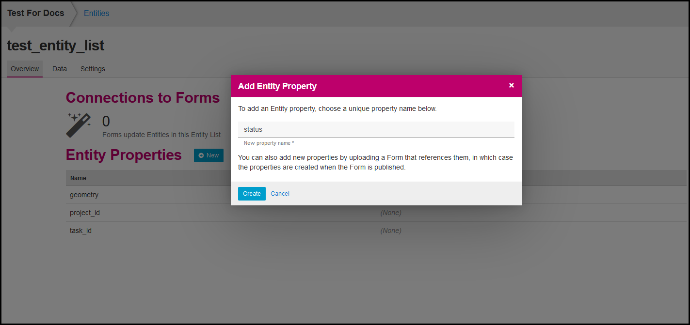

# XLSForm Design (For People In A Hurry)

Adapted and updated from
[this document](https://hotosm.github.io/osm-fieldwork/about/xlsforms/)
in osm-fieldwork.

The full specification for XLSForms can be found [here](https://xlsform.org/en/).

## XLSForm & ODK Terms

A few terms should be explained:

- **XLSForm**: a spreadsheet containing your survey questions.
  - Simply a `.xls` or `.xlsx` file.
  - Can be created with any tool like Microsoft Excel, LibreOffice Calc.
  - Include text and a small amount of spreadsheet logic to generate values.
- **XForm**: an XLSForm that is converted to XML format read by ODK tools.
- **ODK Central**: the server where XForms are stored, plus related submissions.
- **ODK Collect**: the mobile app to load the XForm to make submissions from.
- **XForm ID**: the ID reference of the XForm in ODK.
- **XForm Title**: the friendly name of the survey form that the user sees.
- **Entity**: a fancy term for map `features`, or commonly for our use case,
  `buildings`. Each Entity is a feature to be mapped.
- **Entity List**: a collection of Entities stored on ODK Central.
- **Choices List**: a group of pre-defined options / answers to a survey
  question.

## XLSForm Sheets (Tabs)

- There are four options for sheet (or tab) names:
  - `settings` - metadata like XForm ID & XForm Title.
  - `survey` - the actual question data to ask the user.
  - `choices` - different options to select are stored.
  - `entities` - metadata about the related Entity list for a project.

### Settings Sheet


- `form_id`: XForm ID above.
- `version`: Can be any value, but it is advised to use a date and time via
  spreadsheet formula `=NOW()`.
- `form_title`: XForm Title above.

### Entities Sheet

- Entities were introduced to ODK Central recently in order to more easily track
  the same feature over time.
- We now have a nice way to store a feature, with geometry and properties, in
  ODK Central (for example the buildings you wish to map!).
- The geometry can then be selected in ODK Collect survey questions.


- `list_name`: The Entity List name in ODK.
- `entity_id`: A reference to a field in your survey sheet, such as building ID.
- `update_if`: If set `true()`, the Entity will be updated on form submission,
  else no update will take place.
- `label`: A descriptive user-facing name for the Entity. This can include logic
  to add text or symbols based on a field in the survey sheet (for example,
  mapping status).

### Choices Sheet

- Contains options that can be used to answer a survey question.
- These are used instead of 'free text' input for consistent answers.


- `list_name`: The Choices List name that can be referenced in the survey.
- `name`: The value that can be selected as the question answer.
- `label`: A description of the choice, displayed in ODK Collect.

### Survey Sheet

- The main part of the form - the questions for the survey!

## Translations

- Fields for translations...

## Creating Entities

- For the XLSForm to reference an Entity List for data collection, the Entity
  List must first exist in ODK Central.
- There are two ways described below.

### 1. From The ODK Central UI

- Easiest approach via the user interface of ODK Collect.
- First we generate the Entity List via the UI, with all the fields we
  want included:



> A single field `geometry` would be acceptable, but it can be useful to add
> other fields as references, for example including a mapping `status` field.

- Next we need to generate a `.csv` containing our geometries we want to map,
  including the fields we defined above.
- The `geometry` field must be in JavaRosa geometry format.
- Example JavaRosa polygon (semicolon separated):

```java
-8.38071535576881 115.640801902838 0.0 0.0;
-8.38074220774489 115.640848633963 0.0 0.0;
-8.38080128208577 115.640815355738 0.0 0.0;
-8.38077407987063 115.640767444534 0.0 0.0;
-8.38071535576881 115.640801902838 0.0 0.0
```


The example CSV can be downloaded
[here](../images/xlsform-design/entity-features.csv)

- Now this CSV can be uploaded via the UI and the Entity List will be populated.

### 2. Via Entity List XLSForm Upload

- This is quite a convoluted approach, as a **separate** XLSForm must be
  uploaded to do this.
- An example Entity registration form can be found
  [here](../images/xlsform-design/entities_registration.xls).
- In the end, we will have two XLSForms. One for Entity List creation,
  and another for the actual data collection.
- The key part of this form is in the `survey` sheet, where the Entity data
  fields are defined:


- We will cover in the [Survey Sheet](#survey-sheet) section more details of
  the specifics here, but as you can see we have:
  - A field type to help determine which kind of data we have.
  - A field name that should match those defined in the features CSV file.
  - A field label to display to the user.
  - A `save_to` field to specify which Entity field / property the data will be
    saved to when submitted. This should probably match the field name.
- The form to create the Entity List is then uploaded to ODK Central:


### 3. From Code (API)

-
